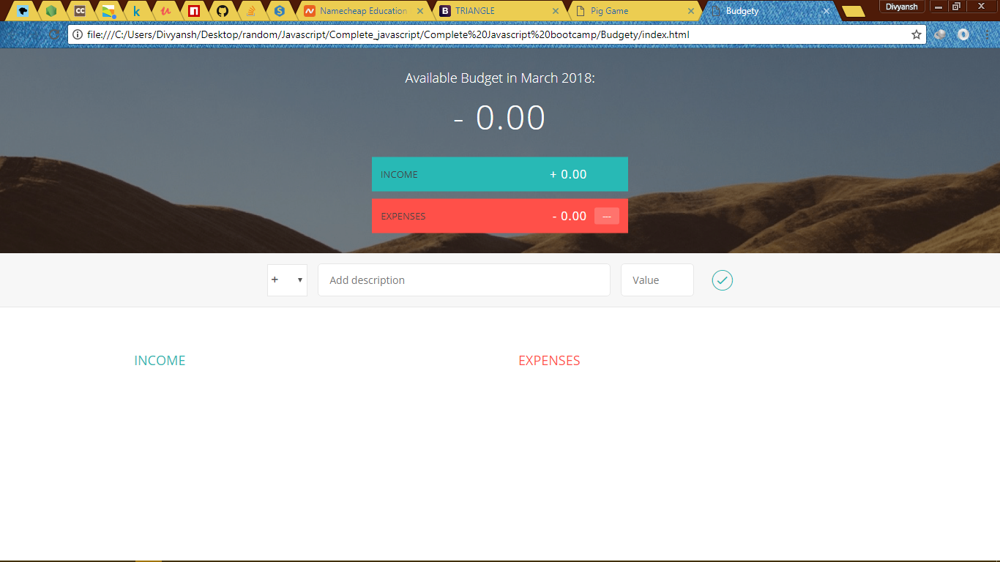
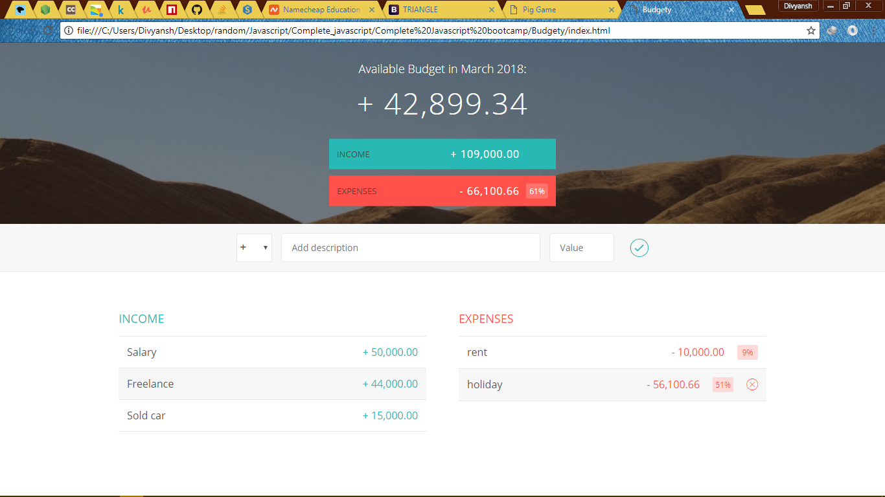

# Budgety

A Budget making app with a pretty ui.

## Getting Started
```
*Clone the repository
*run npm install
*go to localhost:3000
```

### Prerequisites

What things you need to install the software and how to install them

```
*Node js
```

## Built With

* Javascript
*Node js

## Contributing

Please read [CONTRIBUTING.md](https://gist.github.com/PurpleBooth/b24679402957c63ec426) for details on our code of conduct, and the process for submitting pull requests to us.


## Authors

* **Divyansh Dwivedi** - *Initial work*

See also the list of [contributors](https://github.com/your/project/contributors) who participated in this project.

## License

This project is licensed under the MIT License - see the [LICENSE.md](LICENSE.md) file for details

## Screenshots



